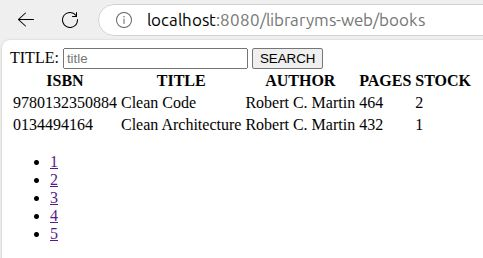
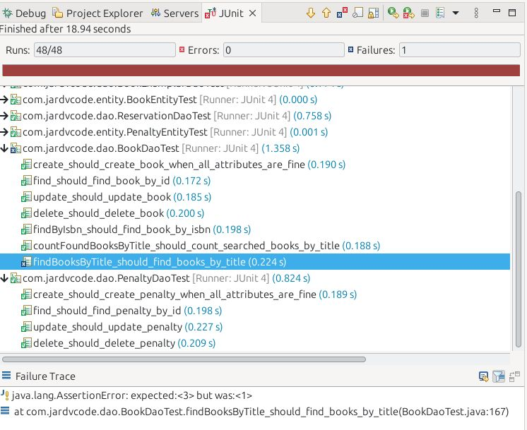

This application was developed to practice Test Driven Development (TDD) and Java EE, in order to deepen the understanding of the web fundamentals used by Spring Boot and Spring Framework. To make it more interesting, older versions of libraries such as JUnit 4 were used.

## Requirements

- Java 8
- Tomcat 6 to 9
- Maven 3.8+
- Eclipse IDE for Enterprise Java and Web Developers 2022-12

## Deployed App

## Testing

